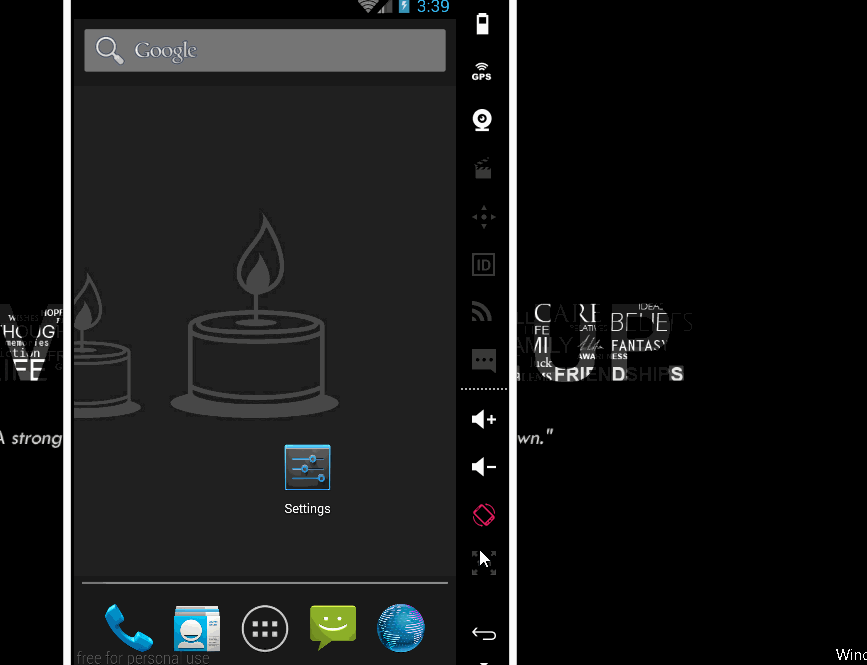

# BasketballTracking
An small demo app to complete the project 2. See the Tutorial on our cliffnotes for a step-by-step tutorial.

Time spent: 4 hours implementation (included searching) in total
 - 07/02: 4 hours

Implement link: https://github.com/TienVNguyen/BasketballTracking

Completed these requirements:
 * [x] App is divided into two columns, one for each team.
 * [x] Each column contains a large TextView to keep track of the current score for that team.
 * [x] Each column contains a button for each of the three kinds of scores: 1, 2, and 3 points.
 * [x] The layout contains a ‘reset’ button.
 * [x] Text sizes are defined in sp.
 * [x] Lengths are defined in dp
 * [x] Padding and margin is used appropriately, such that the views are not crammed up against each other.

Notes:

Walkthrough of all functionalities:

